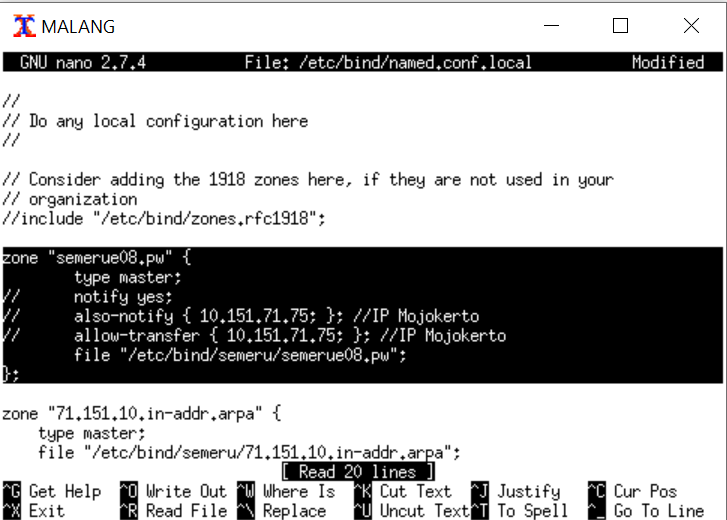
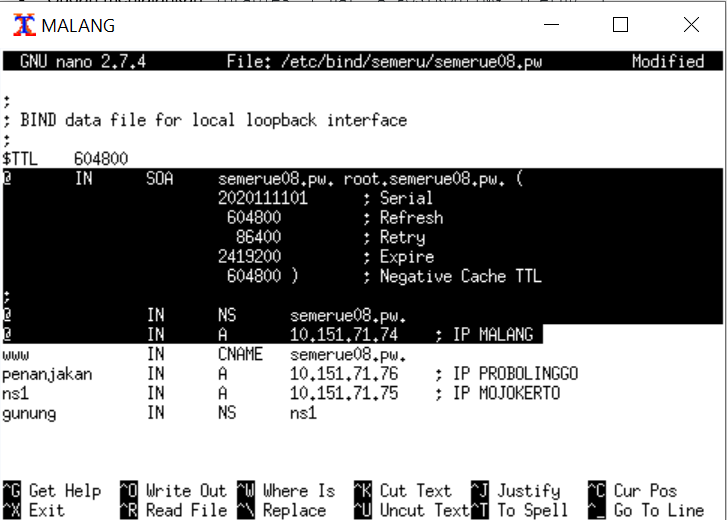
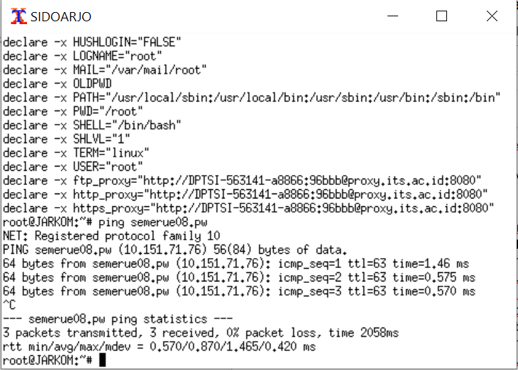
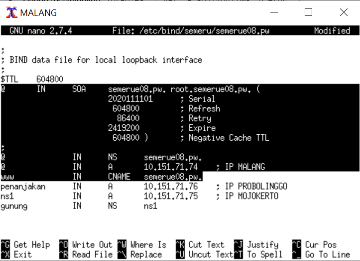
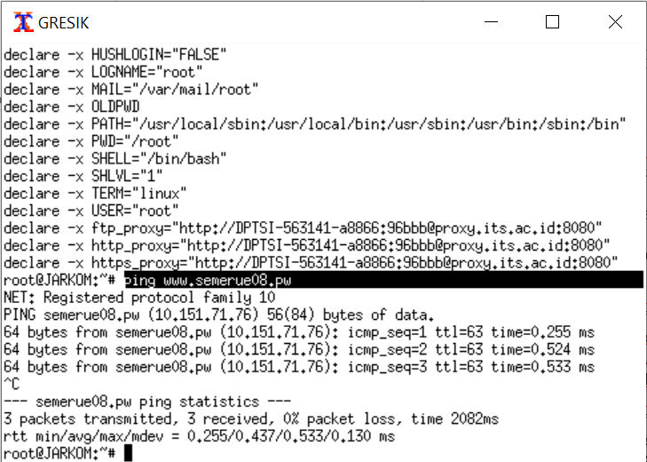

# Jarkom_Modul2_Lapres_E08

## Membuat sebuah website utama dengan alamat http://semeruyyy.pw
- Install bind9 di UML Malang ```apt-get install bind9```
- Buka file ```nano /etc/bind/named.conf.local```
- Konfigurasi file tersebut seperti gambar di bawah lalu simpan
- 
- Buat folder baru ```mkdir etc/bind/semeru```
- Copy file etc/bind/db.local ke file baru di dalam folder semeru ```cp /etc/bind/db.local /etc/bind/semeru/semerue08.pw```
- Buka file ```nano /etc/bind/semeru/semerue08.pw```
- Konfigurasi file tersebut seperti gambar di bawah ini lalu simpan
- 
- Jalankan ```service bind9 restart```
- Pada UML Gresik dan Sidoarjo (client), buka file ```nano /etc/resolv.conf```
- Masukkan IP Malang lalu save
- Berhasil ketika UML Gresik dan/atau Sidoarjo berhasil ping ```ping semerue08.pw```
- 

## Website memiliki alias http://www.semeruyyy.pw
- Pada UML Malang buka file ```nano /etc/bind/semeru/semerue08.pw```
- Konfigurasi file tersebut seperti gambar di bawah lalu simpan
- 
- Jalankan ```service bind9 restart```
- Berhasil ketika UML Gresik dan Sidoarjo berhasil ping ```ping www.semerue08.pw```
- 
