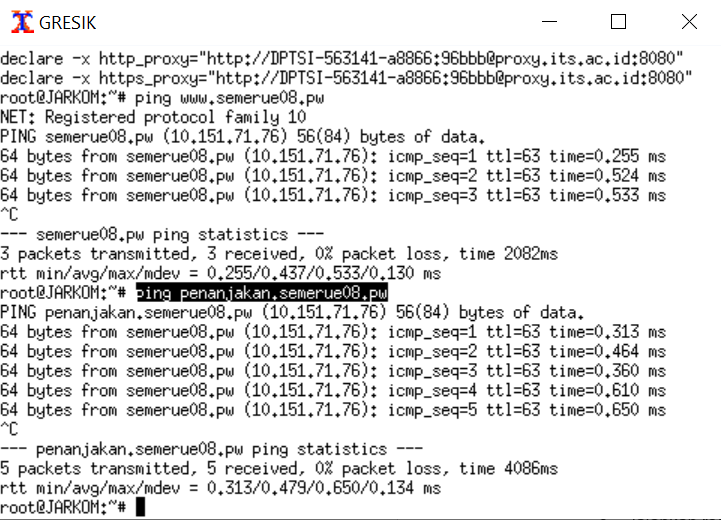
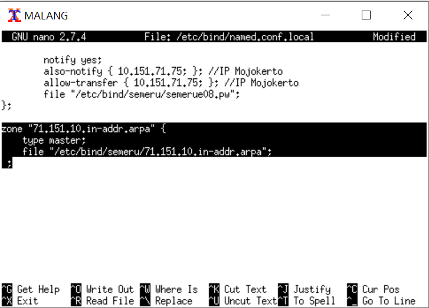
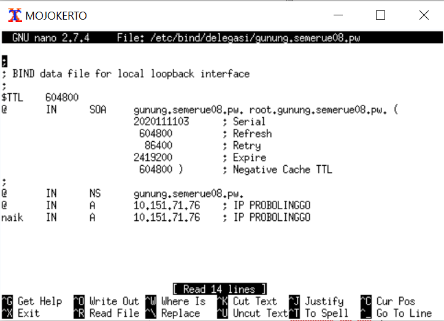

# Jarkom_Modul2_Lapres_E08

## 1. Membuat sebuah website utama dengan alamat http://semeruyyy.pw
- Install bind9 di UML Malang ```apt-get install bind9```
- Buka file ```nano /etc/bind/named.conf.local```
- Konfigurasi file tersebut seperti gambar di bawah lalu simpan
- 
- Buat folder baru ```mkdir etc/bind/semeru```
- Copy file etc/bind/db.local ke file baru di dalam folder semeru ```cp /etc/bind/db.local /etc/bind/semeru/semerue08.pw```
- Buka file ```nano /etc/bind/semeru/semerue08.pw```
- Konfigurasi file tersebut seperti gambar di bawah ini lalu simpan
- 
- Jalankan ```service bind9 restart```
- Pada UML Gresik dan Sidoarjo (client), buka file ```nano /etc/resolv.conf```
- Masukkan IP Malang lalu save
- Berhasil ketika UML Gresik dan/atau Sidoarjo berhasil ping ```ping semerue08.pw```
- 

## 2. Website memiliki alias http://www.semeruyyy.pw
- Pada UML Malang buka file ```nano /etc/bind/semeru/semerue08.pw```
- Konfigurasi file tersebut seperti gambar di bawah lalu simpan
- 
- Jalankan ```service bind9 restart```
- Berhasil ketika UML Gresik dan/atau Sidoarjo berhasil ping ```ping www.semerue08.pw```
- 

## 3. Website memiliki subdomain http://penanjakan.semeruyyy.pw yang diatur DNS-nya pada MALANG dan mengarah ke IP Server PROBOLINGGO
- Pada UML Malang buka file ```nano /etc/bind/semeru/semerue08.pw```
- Konfigurasi file tersebut seperti gambar di bawah ini lalu simpan
- 
- Jalankan ```sevice bind9 restart```
- Berhasil ketika UML Gresik dan/atau Sidoarjo berhasil ping ```ping penanjakan.semerue08.pw```
- 

## 4. Dibuatkan reverse domain untuk domain utama
- Pada UML Malang buka file ```nano /etc/bind/named.conf.local```
- Konfigurasi file tersebut seperti gambar di bawah ini lalu simpan
- 
- Jalankan ```cp /etc/bind/db.local /etc/bind/semeru/71.151.10.in-addr.arpa```
- Buka file ```nano /etc/bind/semeru/71.151.10.in-addr.arpa```
- Konfigurasi file tersebut seperti gambar di bawah ini lalu simpan
- 
- Jalankan ```service bind9 restart```
- Berhasil ketika UML Gresik dan/atau Sidoarjo berhasil menjalankan ```host -t PTR 10.151.71.74```
- 

## 5. Untuk mengantisipasi server dicuri/rusak, Bibah minta dibuatkan DNS Server Slave pada MOJOKERTO agar Bibah tidak terganggu menikmati keindahan Semeru pada Website.
- Pada UML Malang buka file ```nano /etc/bind/named.conf.local```
- Konfigurasi file tersebut seperti gambar di bawah ini lalu simpan
- 
- Pada UML Mojokerto jalankan ```apt-get install bind9```
- Pada UML Mojokerto buka file ```nano /etc/bind/named.conf.local```
- Konfigurasi file tersebut seperti gambar di bawah ini lalu simpan
- 
- Pada UML Malang jalankan ```service bind9 stop```
- Pada UML Mojokerto jalankan ```service bind9 restart```
- Pada UML Gresik dan Sidoarjo (client), buka file ```nano /etc/resolv.conf```
- Masukkan IP Mojokerto lalu save
- 
- Berhasil ketika UML Gresik dan/atau Sidoarjo berhasil ping ```ping semerue08.pw```
- 

## 6. Meminta dibuatkan (6) subdomain dengan alamat http://gunung.semeruyyy.pw yang didelegasikan pada server MOJOKERTO dan mengarah ke IP Server PROBOLINGGO.
- Pada UML Malang buka file ```nano /etc/bind/semeru/semerue08.pw```
- Konfigurasi file tersebut seperti gambar di bawah ini lalu simpan
- 
- Pada UML Malang buka file ```nano /etc/bind/named.conf.options```
- Konfigurasi file tersebut seperti gambar di bawah lalu simpan
- 
- Pada UML Malang buka file ```nano /etc/bind/named.conf.local```
- Konfigurasi file tersebut seperti gambar di bawah lalu simpan
- Jalankan ```service bind9 restart```
- Pada UML Mojokerto buka file ```nano /etc/bind/named.conf.local```
- Konfigurasi file tersebut seperti gambar di bawah lalu simpan
- 
- Buat folder baru ```mkdir /etc/bind/delegasi```
- Jalankan ```cp /etc/bind/db.local /etc/bind/delegasi/gunung.semerue08.pw```
- Konfigurasi file tersebut seperti gambar di bawah lalu simpan
- 
- Jalankan ```service bind9 restart```
- Berhasil ketika UML Gresik dan/atau Sidoarjo ping ```gunung.semerue08.pw```
- 

## 7. Meminta dibuatkan subdomain dengan nama http://naik.gunung.semeruyyy.pw , domain ini diarahkan ke IP Server PROBOLINGGO.
- Pada UML Mojokerto buka file ```nano /etc/bind/delegasi/gunung.semerue08.pw```
- Konfigurasi file tersebut seperti gambar di bawah lalu simpan
- 
- Berhasil ketika UML Gresik dan/atau Sidoarjo ping ```naik.gunung.semerue08.pw```
- 

## 8. Mengatur web server. Domain http://semeruyyy.pw memiliki DocumentRoot pada /var/www/semeruyyy.pw
- Pada UML Probolinggo install apache2 ```apt-get install apache2```
- Install php ```apt-get install php7.0```
- Jalankan ```cp /etc/apache2/sites-available/000-default.conf /etc/apache2/sites-available/semerue08.pw.conf```
- Konfigurasi file tersebut seperti gambar di bawah lalu simpan
- 
- Jalankan ```cd /var/www```
- Jalankan ```wget 10.151.36.202/semeru.pw.zip``` di direktori tersebut
- Unzip
- Jalankan ```a2ensite semerue08.pw.conf```
- Jalankan ```service apache2 restart```
- Berhasil ketika bisa akses semerue08.pw melalui browser
- 

## 9. Diaktifkan mod rewrite agar urlnya menjadi http://semeruyyy.pw/home
- Jalankan ```a2enmod rewrite``` lalu ```service apache2 restart```
- Jalankan ```cd /var/www/semerue08.pw```
- Buat file baru ```nano .htaccess```
- Konfigurasi file tersebut sesuai dengan yang di bawah ini lalu simpan
- 
- Pindah ke directory lain ```cd /etc/apache2/sites-available```
- Buka file ```nano semerue08.pw.conf```
- Konfigurasi file tersebut sesuai yang di bawah ini lalu simpan
- 
- Jalankan ```service apache2 restart```
- Berhasil ketika bisa mengakses ```semerue08/home”```
- 

## 10. Web http://penanjakan.semeruyyy.pw akan digunakan untuk menyimpan assets file yang memiliki DocumentRoot pada /var/www/penanjakan.semeruyyy.pw dan memiliki struktur folder sebagai berikut
## 
- Masuk ke directory ```cd /var/www```
- Jalankan ```wget 10.151.36.202/penanjakan.semeru.pw.zip```
- Unzip
- Pindah ke directory lain ```cd /etc/apache2/sites-available```
- Jalankan ```cp /etc/apache2/sites-available/000-default.conf /etc/apache2/sites-available/penanjakan.semerue08.pw.conf```
- Konfigurasi file tersebut hingga seperti yang di bawah ini lalu simpan
- 
- 
- Jalankan ```a2ensite penanjakan.semerue08.pw.conf``` dan ```service apache2 restart```
- 
- 

## 11. Pada folder /public dibolehkan directory listing namun untuk folder yang berada di dalamnya tidak dibolehkan.
- Jalankan ```nano /etc/apache2/sites-available/penanjakan.semerue08.pw.conf```
- Konfigurasi file tersebut seperti gambar di bawah ini lalu simpan
- 
- Jalankan ```service apache2 restart```
- 
- 
- 
- 

## 12. Untuk mengatasi HTTP Error code 404, disediakan file 404.html pada folder /errors untuk mengganti error default 404 dari Apache.
- Masuk ke directory ```cd /etc/apache2/sites-available```
- Jalankan ```nano /etc/apache2/sites-available/penanjakan.semerue08.pw.conf```
- Konfigurasi file tersebut seperti gamabar di bawah ini lalu simpan
- 
- Jalankan ```service apache2 restart```
- 

## 13. Untuk mengakses file assets javascript awalnya harus menggunakan url http://penanjakan.semeruyyy.pw/public/javascripts. Karena terlalu panjang maka dibuatkan konfigurasi virtual host agar ketika mengakses file assets menjadi http://penanjakan.semeruyyy.pw/js.
- Jalankan ```nano /etc/apache2/sites-available/penanjakan.semerue08.pw.conf```
- Konfigurasi file tersebut seperti gambar di bawah ini lalu simpan
- 
- Jalankan ```service apache2 restart```
- 
